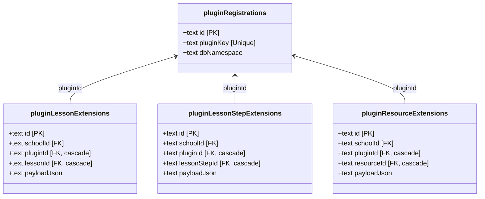

# Phase 45 Specification: Extension & Plugin-Owned Schema Patterns

## 1. 交付目标与背景 (Overview)

在 **Phase 44** 中，我们成功为插件奠定了物理 SQL 级的 `pluginKey`、`dbNamespace` 等正式身份标识，并且彻底规范了安装/对齐与 UI 表达。
在 **Phase 45** 中，我们的核心目标是为插件的数据承载与存储建立正式、高强度、受治理的 **物理 SQL 数据模型范式**，解决之前因缺乏标准而产生的两大痛点：
1. **核心实体字段污染与失控 JSON 滥用 (Core Entity Extension)**：插件在扩展核心实体（如 `lesson`、`lessonStep`、`resource`）时，要么往核心表直接追加专属字段（导致 schema 臃肿退化），要么塞入无结构的 JSON 属性（失去关系数据库的强约束、索引与检索效率）。
2. **缺乏独立业务表空间 (Plugin-Owned Business Tables)**：插件没有存放自身业务模板、调度规则、建议批注等纯私有对象的物理表空间，导致全部数据被迫挂靠在插件注册表上或塞入不相干的核心实体。

通过 Phase 45，我们将为整个系统正式落子两类经过安全审计与严格命名空间隔离的物理 Schema 设计。

---

## 2. 需求 Traceability 与范围 (Requirements Coverage)

本项目完全覆盖 v2.4 需求文档中的 7 项核心规约：

### 核心实体扩展表 (Core Entity Extension)
* **EXT-01**：插件可通过受治理的物理 Extension 表为 `lesson` 保存结构化扩展数据，拒绝零散 JSON 字段。
* **EXT-02**：插件可通过受治理的物理 Extension 表为 `lessonStep` 保存结构化扩展数据，防止向核心表盲目追加插件专属 nullable 列。
* **EXT-03**：插件可通过受治理的物理 Extension 表为 `resource` 保存结构化扩展数据，承载入库与处理等元数据。
* **EXT-04**：扩展表强制关联学校范围 (`schoolId`)、插件归属 (`pluginId`/`pluginKey`)、核心实体关联（`cascade delete` 外键），并提供三维联合唯一索引，保证单插件对单实体扩展的单例性。

### 插件自有独立业务表 (Plugin-Owned Business Tables)
* **OWN-01**：插件可定义和拥有完全独立的业务数据表，持久化私有配置、独立规则、建议建议稿等。
* **OWN-02**：插件自有表必须内置 `schoolId` 物理隔离，且每条记录能追溯到具体的 `pluginId` 安装主表。
* **OWN-03**：插件自有表可通过外键关系单向级联引用核心实体，但卸载插件时，插件表的 Cascade 删除绝对不能反向向上破坏核心表的数据完整性。

---

## 3. 物理 Schema 范式设计 (Physical Database Patterns)

我们采用 SQLite 第一原则，为三个核心实体定义专门的物理扩展表，并规范插件自有业务表的基准约束。

### A. 核心实体扩展表规范
为了保证 Drizzle 静态推导的类型安全与查询性能，我们分别为三个核心实体建立独立的物理扩展表：



#### Drizzle Schema 定义规范：
1. **表前缀强制约束**：由于本阶段聚焦在设计与模式落地，所有扩展表前缀统一定为 `plugin_ext_`，如 `plugin_ext_lesson`。
2. **唯一性复合索引**：
   - 联合 Unique Index 必须包括 `(schoolId, pluginId, entityId)`，从物理上杜绝多重扩展冲突。
3. **外键级联删除 (Foreign Key Cascade)**：
   - `pluginId` references `pluginRegistrations.id` on delete cascade。
   - `entityId` references `entityTable.id` on delete cascade。

### B. 插件自有独立业务表规范
我们以 Reminders 插件及 RAG Processing 插件所需的业务场景为蓝本，设计标准的插件独立业务表 `plugin_owned_business_data` 作为首个范式：
- 字段强制包含 `schoolId` 物理列。
- 字段强制包含 `pluginId` 物理列，并绑定 cascade 外键。
- 可以使用 `lessonId` 或 `resourceId` 的级联外键指向核心表。当核心课程或资源被物理删除时，插件表中的附属数据自动随之 Cascade 清理。

---

## 4. 关键 DAL 接口设计与安全切面 (DAL Design)

插件数据的读写绝对禁止绕过权限与隔离边界，所有操作都必须收口在 DAL 服务中。

### A. 扩展表通用读写接口
```typescript
interface UpsertExtensionInput {
  actorId: string;
  schoolId: string;
  pluginId: string;
  entityId: string;
  payloadJson: Record<string, any>;
}

/**
 * 统一的核心实体扩展 upsert 接口，实现严格权限控制与幂等性
 */
export async function upsertEntityExtension(
  input: UpsertExtensionInput
): Promise<void>;
```

### B. 安全校验机制 (Safety Gates)
- **学校隔离 (School Scoping)**：每一个 DAL 方法内部强制断言输入 `schoolId` 与目标实体的 `schoolId` 以及操作员的 scope 范围绝对一致。
- **冲突防范 (Single Instance)**：通过物理 Unique Index 与 DAL 前置拦截相结合，彻底防止因并发写入导致单实体拥有多个同插件扩展的异常。

---

## 5. UAT 验收标准 (User Acceptance Criteria)

| 编号 | UAT 测试场景 | 预期成功行为 |
|---|---|---|
| **UAT-45-01** | **核心实体扩展表读写** | 插件在特定 Lesson 上成功写入扩展字段；再次写入时自动更新（幂等），且能正确查到数据。 |
| **UAT-45-02** | **跨学校越界写入防御** | 传入不匹配的 `schoolId` 尝试写入或读取时，DAL 接口自动断言失败并抛出隔离越权异常。 |
| **UAT-45-03** | **冲突与联合唯一性校验** | 模拟并发在同一 Lesson 上创建重复的单插件扩展记录，SQLite 触发 Unique 约束报错，平台 DAL 能够幂等解决或拦截。 |
| **UAT-45-04** | **物理级联删除 (Cascade)** | 当删除某个插件安装记录（`pluginRegistration`）或某个课程（`lesson`）时，对应的扩展物理记录与附属插件业务数据自动在 SQLite 中 Cascade 清理干净，不留孤儿数据。 |

---

## 6. 完结验证与 Close Gate 规划

我们将在 Phase 45-04 或 45-05 完结时，建立一键闭环的 `verify:phase45` 验证机制，至少包含：
- **静态表结构扫描**：检查 schema 定义文件，保证符合 `plugin_ext_` 前缀命名空间规则。
- **物理数据库级联外键测试**：利用 mock 数据库，手动 insert 扩展记录后，调用 delete 课程或 delete 插件动作，断言扩展表中对应数据完全消失。
- **单元测试回归集成**。
