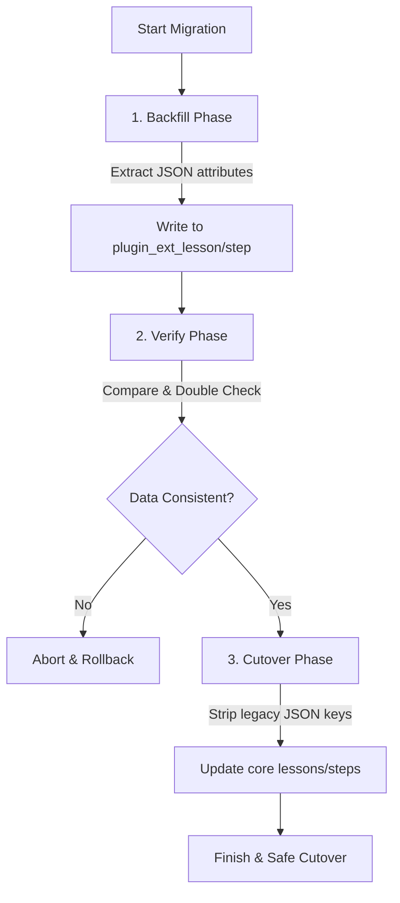

# Phase 46 Specification: Migration Governance & Backfill Safety

## 1. 交付目标与背景 (Overview)

随着 **Phase 45** 成功落地了插件扩展与自有物理数据模式（`plugin_ext_` 与 `plugin_owned_`），我们需要确保这些表结构的演进与数据状态变化得到科学的管辖。
在 **Phase 46** 中，我们将确立三项核心治理原则，杜绝由于插件自主行为带来数据库被污染、结构漂移以及数据不一致的风险：
1. **Drizzle Migration 绝对权威 (Migration Governance)**：
   - 严禁任何插件生命周期行为（install/enable/disable）在运行时自主执行 `CREATE TABLE`、`ALTER TABLE` 等 DDL 动作。所有数据库结构变更必须在开发阶段通过主仓库的 Drizzle Kit 生成迁移文件，并在运维阶段通过 `pnpm db:migrate` 流程统一执行。
2. **命名空间与前缀规则强制治理 (Naming & Prefix Enforcement)**：
   - 规定并强力校验所有插件数据库表、复合索引及外键的命名。在开发和持续集成（CI）环节，阻断任何不符合 `plugin_ext_` 或 `plugin_owned_` 命名范式的 Drizzle 定义提交。
3. **JSON 结构化回填与安全割接机制 (Backfill & Cutover Safety)**：
   - 针对系统先前将扩展数据存放在核心实体（如 `lessons.payloadJson` 或者是 `lessonSteps.payloadJson`）的零散属性属性，提供一套安全、幂等、可审查的 **Backfill 与 Cutover 脚手架**，确保将 JSON 中的数据平滑剥离并迁移进专属物理扩展表，不发生 split-brain 真相或数据破损。

---

## 2. 需求 Traceability 与范围 (Requirements Coverage)

本阶段完全覆盖 v2.4 需求文档中的 4 项核心治理规约：
* **GOV-01**：平台维护者可以通过主仓库统一的 Drizzle migration 流程演进插件 schema，而不是依赖运行时动态建表或插件自带 SQL。
* **GOV-02**：系统可以强制插件表、索引和唯一约束遵循统一的前缀 / namespace 命名规则。
* **GOV-03**：平台维护者可以为 JSON -> 结构化插件数据迁移定义可审查的 backfill 与 cutover 流程。
* **GOV-04**：插件启用、停用或安装流程不会在运行时执行未审查的 DDL 或任意 SQL migration。

---

## 3. 核心方案与架构设计 (Architectural Principles)

### A. 命名规范与静态强制校验器 (Naming Guardrail)
我们在 `scripts/verify-phase46-migration-governance.ts` 中建立高强度的静态语法分析（或利用 AST 解析 `src/db/schema.ts`）：
1. **表名限制**：任何新增的非核心系统表，只要与插件挂钩，必须以 `plugin_ext_` 或 `plugin_owned_` 开头。
2. **索引与唯一约束限制**：对应的 Drizzle `uniqueIndex()` 或 `index()` 名字必须强制带有 `plugin_ext_` 或 `plugin_owned_` 前缀，严禁污染公共命名空间。
3. **主仓库同步验证**：确保 `drizzle/` 目录下生成的所有物理 SQL 迁移文件中不含非合规命名的表操作。

### B. 运行时 DDL 预防与拦截机制 (Runtime DDL Prevention)
- 在系统核心 DAL 中，插件的任何 lifecycle 行为（如安装注册、启动 reconcile、修改启用状态等）绝对不允许执行任何动态 DDL 语句。
- 所有的安装与对齐动作均收口于 `installOrReconcilePlugin`（在 Phase 44 中实现）。我们将通过单元测试断言：在执行这些插件全生命周期转换操作时，底层不发出任何 DDL query。

### C. JSON -> 结构化回填与安全割接协议 (Backfill & Cutover Protocol)
为平滑升级存量数据，我们设计统一的 **数据割接服务层 `src/lib/dal/plugin-migration.ts`**，包括以下三阶段流程：

1. **Backfill 阶段 (数据回填)**：
   - 传入学校标识和数据类型，智能读取核心表（例如 `lesson`）中 `payloadJson` 内具有插件命名空间（比如 `'reminders'` 插件特征）的旧数据。
   - 解析此 JSON 为结构化字段，调用 `upsertPluginExtension` 幂等写入至 `plugin_ext_lesson` 等扩展表。
2. **Verify 阶段 (数据核对)**：
   - 提取新物理表中的 `payloadJson` 内容，与原核心表 JSON 中备份的内容执行深对比校验，确保每一项属性和数据无损。
3. **Cutover 阶段 (割接与旧数据擦除)**：
   - 数据对齐后，启动数据库事务，擦除旧核心表中 JSON 属性里的冗余插件特征字段（保留其他与该插件无关的常规配置）。
   - 切断双重读写，以后 DAL 读写完全以物理扩展表为准，不留双真相分裂窗口。

---

## 4. UAT 验收标准 (User Acceptance Criteria)

| 编号 | UAT 测试场景 | 预期成功行为 |
|---|---|---|
| **UAT-46-01** | **运行时 DDL 彻底清空验证** | 执行默认插件 reconcile 或安装新插件时，断言底层 SQLite 绝不发生任何建表、修表等 DDL 语句，全生命周期平滑纯净。 |
| **UAT-46-02** | **表与索引前缀强制规制** | 尝试将不带 `plugin_ext_` 或 `plugin_owned_` 前缀的表定义放入插件扩展命名空间时，静态检查脚本报错退出。 |
| **UAT-46-03** | **JSON 割接平滑迁移与原子性** | 模拟原 `lessons.payloadJson` 包含 reminders 插件数据。运行 `plugin-migration` 接口，原 JSON 数据能一键完美平滑搬入新扩展表，并清除旧字段。若 Verify 对比失败，自动回滚，割接终止。 |
| **UAT-46-04** | **一键 Close Gate 自动化锁定** | 编写 `verify:phase46`，一键通过物理、静态、单元及回归测试，成功后方可进阶至 Phase 47。 |

---

## 5. 完结验证与 Close Gate 规划

完结 Phase 46 时，需建立 `verify:phase46` 验证脚手架：
- 扫描 `src/db/schema.ts` 源码以断言没有命名违规。
- 运行针对 DDL 拦截和 Backfill/Cutover 的完整 Vitest 集成测试。
- 链式触发 `verify:phase44` 与 `verify:phase45`，保证安全向前兼容。
