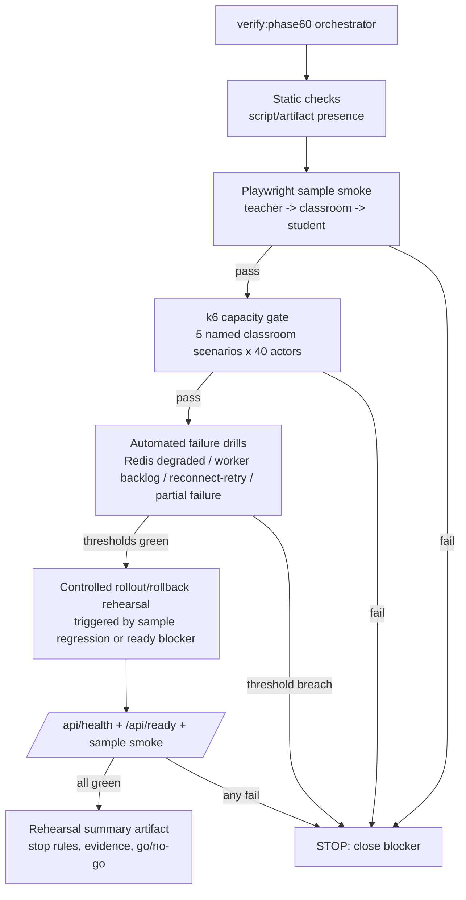

# Phase 60: Load, Degrade & Pilot Rehearsal - Research

**Researched:** 2026-05-28
**Domain:** 单校试点课堂投票样板的双轨负载 gate、降级演练、rollout/rollback rehearsal
**Confidence:** MEDIUM

<user_constraints>
## User Constraints (from CONTEXT.md)

### Locked Decisions

### Load gate architecture
- **D-60-01:** Phase 60 的负载验证采用 **分层双轨**：Playwright 只负责锁定真实课堂投票样板 smoke；k6 或等价协议层负载 gate 负责锁定 40/5 容量口径。
- **D-60-02:** 浏览器样板 smoke 与 k6 容量 gate 都是 **hard blockers**；任一失败都不能宣称 Phase 60 close。
- **D-60-03:** 40/5 容量口径必须按 **5 个并发 classroom/session，每个课堂 40 个 student actor** 建模，而不是退化成松散的 200 全局用户池。
- **D-60-04:** Playwright 轨道的职责是证明“真实教师/学生样板链路仍成立”，不是承担容量证明；容量证明必须落在 k6 或等价更稳定的协议/服务层 gate 上。

### Failure drill coverage
- **D-60-05:** Phase 60 的 automated gates 至少必须覆盖四类 failure drill：`Redis degraded`、`worker backlog`、`学生 reconnect/retry`、`partial failure`。
- **D-60-06:** `transport fallback` 在 Phase 60 中保留为 **现场 rehearsal / runbook 执行面**，不是首选 automated gate；它需要验证 operator 何时判定进入 fallback、如何观察影响、何时升级到 rollback。
- **D-60-07:** 所有 failure drills 都必须继续沿用 Phase 58 的 honesty posture 与 Phase 55 的 failure taxonomy；Phase 60 只验证这些姿态在 rehearsal 中是否真实成立，不重写表达语义。

### Stop rules and blocker posture
- **D-60-08:** Phase 60 必须采用 **明确 stop rules**，不能只给 advisory 或“尽量不要失败”的方向性建议。
- **D-60-09:** blocker posture 采用 **关键项一票否决**：样板 smoke 失败、40/5 容量 gate 失败、worker blocking posture 未恢复、或受控 rollback rehearsal 失败，都直接阻断 close。
- **D-60-10:** planner 必须为以下维度给出明确数字阈值并写入计划/验证产物：`reconnect 恢复时长`、`worker backlog 可接受窗口`、`partial failure 可接受比例`、`degraded 持续时长`。讨论阶段先锁维度，不预先锁死具体数字。
- **D-60-11:** 任何超出这些阈值的 rehearsal 结果，都必须被解释为 close blocker、rollback trigger、或至少明确升级条件；不能留给 milestone close 时再口头裁量。

### Rollout and rollback rehearsal depth
- **D-60-12:** rollout/rollback 必须做 **一次受控真回滚 rehearsal**，不能只停留在 dry-run 或桌面推演。
- **D-60-13:** 这次真回滚必须由 **样板回归或 `/api/ready` blocking posture** 触发，保证它直接对齐 Phase 59 的 deploy/rollback contract 与 Phase 60 的 close blocker 语义。
- **D-60-14:** 回滚成功的最低证明固定为 **`/api/health` green + `/api/ready` green + 样板 smoke 恢复通过**；只恢复 probe、不恢复样板链路，不算 rehearsal 完成。
- **D-60-15:** rollout/rollback rehearsal 继续复用 Phase 59 的 canonical manifest、`current.json` / `green.json`、systemd units、checklists 与 release probe truth，不额外发明第二套发布语义。

### the agent's Discretion
- k6 具体场景拆分、VU 组织方式、teacher/student actor 的实现技术、以及 WebSocket/HTTP 混合建模细节，可由 researcher / planner 在不违背 D-60-01 至 D-60-04 的前提下做最小正确收敛。
- stop rule 的具体数值、告警文案、统计窗口、以及 rehearsal summary 的最终表格结构，可由 planner 依据现有 verifier / release artifact 风格统一收敛，但不得把硬 blocker 重新降格为 advisory。
- `transport fallback` rehearsal 的具体执行形式，可选择脚本辅助 + 人工操作记录或等价方式，只要最终能留下清晰的 trigger、影响范围、operator 动作与结论证据。

### Deferred Ideas (OUT OF SCOPE)
None — discussion stayed within phase scope.
</user_constraints>

<phase_requirements>
## Phase Requirements

| ID | Description | Research Support |
|----|-------------|------------------|
| LOAD-01 | 必须有面向课堂投票样板的定向压测，覆盖 40/5 容量假设。 [VERIFIED: .planning/REQUIREMENTS.md] | `k6` 场景与阈值适合把 5 classroom × 40 student actor 建模成具名 scenario/tag，并以 threshold 直接给出 pass/fail gate。 [CITED: https://grafana.com/docs/k6/latest/using-k6/scenarios/] [CITED: https://grafana.com/docs/k6/latest/using-k6/thresholds/] |
| LOAD-02 | 必须验证 degraded、reconnect、worker backlog、retry 与 partial failure 场景，而不是只验证 happy path。 [VERIFIED: .planning/REQUIREMENTS.md] | Phase 58 已有 honesty/runbook 基线，Phase 59 已有 ready probe truth；Phase 60 应把这些 failure drill 接成 automated gate + rehearsal evidence。 [VERIFIED: scripts/verify-phase58-operator-recovery-and-surfaces.ts] [VERIFIED: src/lib/ops/release-status.ts] |
| OPS-02 | Redis degraded、worker lag、transport fallback、plugin disabled 等降级姿态必须诚实暴露在 operator surface。 [VERIFIED: .planning/REQUIREMENTS.md] | `release-status.ts` 已把 worker 设为 blocking、fanout 设为 non-blocking degraded；Phase 60 应复用该 truth，而不是改定义。 [VERIFIED: src/lib/ops/release-status.ts] |
| ENVR-03 | 发布必须具备 release traceability、rollout checklist 与 rollback checklist。 [VERIFIED: .planning/REQUIREMENTS.md] | deploy/rollback 脚本、manifest pointers、rollout/rollback checklist 已存在，Phase 60 只需把 rehearsal 证据挂上去。 [VERIFIED: ops/deploy/deploy.sh] [VERIFIED: ops/deploy/rollback.sh] [VERIFIED: ops/releases/checklists/rollout.md] [VERIFIED: ops/releases/checklists/rollback.md] |
| SAFE-03 | SQLite 与附加资产必须具备备份恢复、restore drill 与恢复后校验。 [VERIFIED: .planning/REQUIREMENTS.md] | Phase 59 已完成真实 restore drill；Phase 60 不重做 restore baseline，只需要保证 rollback rehearsal 后仍满足 `health + ready + sample smoke`。 [VERIFIED: .planning/phases/59-deploy-release-recovery-baseline/59-RESTORE-DRILL.md] [VERIFIED: .planning/phases/59-deploy-release-recovery-baseline/59-VERIFICATION.md] |
</phase_requirements>

## Summary

Phase 60 不是“再写一套测试”，而是把 Phase 57 的真实样板 smoke、Phase 58 的 honesty/failure taxonomy、以及 Phase 59 的 release truth 合并成一个正式 close gate。仓库已经存在可复用的 repo-local verifier 模式（`verify:phase57/58/59`）、真实 browser proof、`/api/health`/`/api/ready`/`/api/release` truth surface、以及 deploy/rollback/checklist baseline；因此本阶段的 planning 重点应是“如何拼装成双轨 hard gate + rehearsal evidence”，而不是发明新框架。 [VERIFIED: package.json] [VERIFIED: scripts/verify-phase57-classroom-runtime.ts] [VERIFIED: scripts/verify-phase58-operator-recovery-and-surfaces.ts] [VERIFIED: scripts/verify-phase59-deploy-release.ts] [VERIFIED: src/lib/ops/release-status.ts] [VERIFIED: ops/deploy/deploy.sh] [VERIFIED: ops/deploy/rollback.sh]

浏览器轨应严格限定为少量 Playwright smoke，用来证明教师/学生真实链路还活着；容量轨应交给协议层 `k6`，因为 k6 官方文档明确推荐用 scenarios + thresholds 建模并用 hybrid approach 让少量 browser 流和大量 protocol 流分离，且浏览器 VU 有额外资源开销。结合本项目锁定的 Phase 60 边界，最稳妥的计划是：复用现有 `runPhase57BrowserProof()` 作为 smoke 核心，新增 `verify:phase60` 作为统一 orchestrator，再把 5 个 classroom-affined k6 scenario、四类 automated failure drills、一次受控真 rollback rehearsal 和一个 summary artifact 收口到同一 close gate。 [VERIFIED: scripts/proof-phase57-classroom-runtime.ts] [CITED: https://grafana.com/docs/k6/latest/using-k6/scenarios/] [CITED: https://grafana.com/docs/k6/latest/using-k6/thresholds/] [CITED: https://grafana.com/docs/k6/latest/using-k6-browser/recommended-practices/hybrid-approach-to-performance/]

**Primary recommendation:** 规划一个 `verify:phase60` repo-local verifier：`static checks -> Playwright sample smoke -> k6 40/5 capacity gate -> automated failure drills -> controlled rollback rehearsal -> summary artifact`，并让任何 blocker 直接返回失败退出码。 [VERIFIED: scripts/verify-phase57-classroom-runtime.ts] [VERIFIED: scripts/verify-phase59-deploy-release.ts] [CITED: https://grafana.com/docs/k6/latest/using-k6/thresholds/]

## Project Constraints (from AGENTS.md)

- 必须继续使用 Next.js 16 App Router、React 19.2、Turbopack、Auth.js v5、Drizzle ORM、SQLite 首发。 [VERIFIED: AGENTS.md]
- UI 组件禁止直连数据库；所有读写必须通过 DAL 和 Server Actions。 [VERIFIED: AGENTS.md]
- Node.js 20.9+ 是主运行时；Edge Runtime 仅用于 SSE 实时同步。 [VERIFIED: AGENTS.md]
- Next.js 16 必须显式缓存；写入后必须更新或失效 tag。 [VERIFIED: AGENTS.md]
- 首发只针对 SQLite，所有关联必须 cascade delete。 [VERIFIED: AGENTS.md]
- 插件禁止 `eval()`、动态执行第三方代码、直接访问 DB 或核心 API。 [VERIFIED: AGENTS.md]
- 页面实现必须参考 Stitch 项目 `5322129002350954765` 与 `DESIGN.md`。本 phase 主要是验证与 rehearsal，不应扩散为新 UI 工程。 [VERIFIED: AGENTS.md]

## Architectural Responsibility Map

| Capability | Primary Tier | Secondary Tier | Rationale |
|------------|-------------|----------------|-----------|
| 真实教师/学生样板 smoke | Browser / Client | Frontend Server (SSR) | Playwright 要验证的是真实页面、真实导航、真实文案和真实会话边界；仓库现有 proof 直接启动浏览器并访问 `/teacher`、`/classroom`、`/student/player`。 [VERIFIED: scripts/proof-phase57-classroom-runtime.ts] |
| 40/5 容量 gate | API / Backend | Database / Storage | 容量证明应落在协议/服务层，而不是浏览器层；请求最终仍回到 DAL/SQLite truth、worker、transport 发布路径。 [VERIFIED: .planning/phases/60-load-degrade-pilot-rehearsal/60-CONTEXT.md] [VERIFIED: src/features/runtime-platform/seams/transport/gateway.ts] |
| degraded / backlog / partial-failure truth | API / Backend | Database / Storage | `ready` posture、transport attempts、consumer traces、worker heartbeats 都由服务端和持久化记录决定。 [VERIFIED: src/lib/ops/release-status.ts] [VERIFIED: src/features/runtime-platform/seams/transport/gateway.ts] |
| transport fallback rehearsal | Browser / Client | API / Backend | fallback 是否触发由运行态体验和 operator 观察共同决定，但最终要落回服务端 honesty surface 和 runbook 证据。 [VERIFIED: .planning/phases/60-load-degrade-pilot-rehearsal/60-CONTEXT.md] [VERIFIED: .planning/phases/55-pilot-scope-and-acceptance-gate/55-FAILURE-RECOVERY-MATRIX.md] |
| rollout / rollback rehearsal | Frontend Server (SSR) | API / Backend | 真正的切换动作发生在 deploy/rollback/systemd/probe 面，成功与否由 `/api/health`、`/api/ready` 与样板 smoke 共同裁决。 [VERIFIED: ops/deploy/deploy.sh] [VERIFIED: ops/deploy/rollback.sh] [VERIFIED: .planning/phases/60-load-degrade-pilot-rehearsal/60-CONTEXT.md] |
| proof artifacts / stop-rule summary | Database / Storage | API / Backend | 这类产物应从 manifest、checklists、probe 结果、verifier 输出稳定汇总，而不是临场口头说明。 [VERIFIED: .planning/phases/55-pilot-scope-and-acceptance-gate/55-PROOF-INVENTORY.md] [VERIFIED: .planning/phases/60-load-degrade-pilot-rehearsal/60-CONTEXT.md] |

## Standard Stack

### Core
| Library / Surface | Version | Purpose | Why Standard |
|---------|---------|---------|--------------|
| `playwright` (existing library script path) | repo-installed `1.59.1`; npm latest `1.60.0` (registry modified 2026-05-27) [VERIFIED: package.json] [VERIFIED: npm registry] | 保留真实 teacher/student smoke。 [VERIFIED: scripts/proof-phase57-classroom-runtime.ts] | 仓库已有 `chromium.launch()` + cookie seeding + route prewarm + role/text assertions 的 working proof，Phase 60 最小改动应直接复用它。 [VERIFIED: scripts/proof-phase57-classroom-runtime.ts] |
| `k6` CLI | latest GitHub release `v2.0.0` published 2026-05-11 [CITED: https://api.github.com/repos/grafana/k6/releases/latest] | 承担协议层容量 gate、阈值 gate、failure drill gate。 [CITED: https://grafana.com/docs/k6/latest/using-k6/scenarios/] [CITED: https://grafana.com/docs/k6/latest/using-k6/thresholds/] | k6 的 scenarios/thresholds 是当前官方标准做法；Phase 60 已锁定要用 k6 或等价协议层，而不是浏览器容量脚本。 [VERIFIED: .planning/phases/60-load-degrade-pilot-rehearsal/60-CONTEXT.md] [CITED: https://grafana.com/docs/k6/latest/using-k6/scenarios/] |
| repo-local `verify:phaseNN` verifier pattern | existing pattern [VERIFIED: package.json] | 统一静态检查、focused suites、proof/rehearsal gate。 [VERIFIED: scripts/verify-phase57-classroom-runtime.ts] [VERIFIED: scripts/verify-phase58-operator-recovery-and-surfaces.ts] [VERIFIED: scripts/verify-phase59-deploy-release.ts] | 这是仓库已经稳定使用的 close-gate 组织方式；Phase 60 应延续成 `verify:phase60`，而不是散落 shell 命令。 [VERIFIED: package.json] |
| `/api/health` + `/api/ready` + canonical manifest pointers | repo-local truth surface [VERIFIED: src/lib/ops/release-status.ts] | rollout/rollback 是否可接受的官方裁决面。 [VERIFIED: src/lib/ops/release-status.ts] | Phase 60 决策已明确要求真回滚的最低证明是 `health + ready + sample smoke`，且必须复用 `current.json`/`green.json`。 [VERIFIED: .planning/phases/60-load-degrade-pilot-rehearsal/60-CONTEXT.md] |

### Supporting
| Library / Surface | Version | Purpose | When to Use |
|---------|---------|---------|-------------|
| Vitest | `4.1.5` repo-installed [VERIFIED: package.json] | 跑 focused suites，验证 seam truth、verifier helpers、close-gate 结构。 [VERIFIED: vitest.config.mts] | 用于 Phase 60 的 verifier helper 测试、stop-rule evaluator 测试、drill orchestrator 单测。 [ASSUMED] |
| Docker `grafana/k6:latest` fallback | Docker `29.5.1` available locally; k6 host binary missing [VERIFIED: environment probe] | 当本机没有 k6 时运行协议层负载 gate。 [CITED: https://grafana.com/docs/k6/latest/set-up/install-k6/] | 当前环境 `k6` 缺失但 Docker 可用，因此 planner 应提供 Docker fallback，避免把 host install 当成默认前提。 [VERIFIED: environment probe] |
| `ops/deploy/deploy.sh` / `ops/deploy/rollback.sh` | repo-local [VERIFIED: ops/deploy/deploy.sh] [VERIFIED: ops/deploy/rollback.sh] | 真 rollout/rollback rehearsal。 | 只要需要受控真回滚，就必须调用既有脚本而不是 dry-run 新脚本。 [VERIFIED: .planning/phases/60-load-degrade-pilot-rehearsal/60-CONTEXT.md] |
| `ops/releases/checklists/*.md` | repo-local [VERIFIED: ops/releases/checklists/rollout.md] [VERIFIED: ops/releases/checklists/rollback.md] | 现场 rehearsal 记录模板与证据对齐。 | transport fallback、rollback trigger、post-rollback verification 都应回挂到现有 checklist。 [VERIFIED: ops/releases/checklists/rollout.md] [VERIFIED: ops/releases/checklists/rollback.md] |

### Alternatives Considered
| Instead of | Could Use | Tradeoff |
|------------|-----------|----------|
| Playwright 证明容量 | k6 browser / 大量 browser VUs | 官方明确说明 browser VU 有明显资源开销，推荐 hybrid approach；本 phase 已锁定 browser 只做 smoke。 [CITED: https://grafana.com/docs/k6/latest/using-k6-browser/recommended-practices/hybrid-approach-to-performance/] [VERIFIED: .planning/phases/60-load-degrade-pilot-rehearsal/60-CONTEXT.md] |
| Host 安装 k6 | Docker `grafana/k6:latest` | Host 安装更快，但当前环境 k6 缺失；Docker 已可用，是可执行 fallback。 [VERIFIED: environment probe] [CITED: https://grafana.com/docs/k6/latest/set-up/install-k6/] |
| 新建一套 Phase 60 发布脚本 | 复用 Phase 59 deploy/rollback/checklists | 新脚本会制造第二套 release truth，直接违背 D-60-15。 [VERIFIED: .planning/phases/60-load-degrade-pilot-rehearsal/60-CONTEXT.md] |

**Installation:**
```bash
# Browser smoke dependency already exists in repo
pnpm exec playwright --version

# Preferred host install for protocol load gate
sudo apt-get update && sudo apt-get install k6

# Fallback when host install is unavailable
docker pull grafana/k6:latest
```

**Version verification:**
- `playwright` npm latest is `1.60.0`, registry modified `2026-05-27T15:23:24.654Z`. [VERIFIED: npm registry]
- Repo currently installs `playwright@1.59.1` and `pnpm exec playwright --version` returns `1.59.1`. [VERIFIED: package.json] [VERIFIED: local CLI probe]
- `k6` current latest official release is `v2.0.0`, published `2026-05-11T09:27:15Z`. [CITED: https://api.github.com/repos/grafana/k6/releases/latest]

## Architecture Patterns

### System Architecture Diagram



### Recommended Project Structure
```text
scripts/
├── verify-phase60-load-and-rehearsal.ts   # repo-local close gate orchestrator
├── verify-phase60-load-and-rehearsal.test.ts
└── load/
    ├── phase60-capacity.k6.js            # 5 classroom scenarios + thresholds
    ├── phase60-drills.k6.js              # degraded/backlog/retry/partial failure drills
    └── phase60-fixtures.ts               # actor/session seed helpers (if using pre-run generation)

ops/releases/
└── evidence/
    └── phase60/
        ├── rehearsal-summary.md          # hard-gate result + stop-rule hits
        ├── rollout-notes.md              # checklist execution notes
        └── rollback-notes.md             # post-rollback proof notes
```

### Pattern 1: Repo-local verifier as the only phase gate
**What:** 把 static checks、focused suites、browser smoke、k6 run、rollout/rollback rehearsal 串到一个 `verify:phase60`。 [VERIFIED: package.json] [VERIFIED: scripts/verify-phase57-classroom-runtime.ts] [VERIFIED: scripts/verify-phase59-deploy-release.ts]
**When to use:** 只要目标是 “Phase 60 close gate”，而不是单次临时试验。 [VERIFIED: .planning/phases/60-load-degrade-pilot-rehearsal/60-CONTEXT.md]
**Example:**
```typescript
// Source: scripts/verify-phase57-classroom-runtime.ts + scripts/verify-phase59-deploy-release.ts
runVitest(getPhase59FocusedSuitePaths(), "Phase 59 focused deploy-release suites");
await runPhase57BrowserProof();
```

### Pattern 2: Browser smoke and protocol load stay split
**What:** Playwright 只保真；k6 才承载并发与阈值。 [VERIFIED: .planning/phases/60-load-degrade-pilot-rehearsal/60-CONTEXT.md] [CITED: https://grafana.com/docs/k6/latest/using-k6-browser/recommended-practices/hybrid-approach-to-performance/]
**When to use:** 所有需要证明“真实链路仍成立 + 40/5 容量成立”的 close gate。 [VERIFIED: .planning/REQUIREMENTS.md]
**Example:**
```javascript
// Source: https://grafana.com/docs/k6/latest/using-k6/scenarios/
export const options = {
  scenarios: {
    classroom_1: { executor: 'per-vu-iterations', vus: 40, iterations: 1, tags: { classroom: '1' } },
    classroom_2: { executor: 'per-vu-iterations', vus: 40, iterations: 1, tags: { classroom: '2' } },
  },
};
```

### Pattern 3: Failure drill automation stops at truth seams; operator posture stays honest
**What:** 自动化 drill 应打到 `ready` posture、transport attempts、runtime sample chain 和 worker backlog truth seam；不要伪造 operator 结论。 [VERIFIED: src/lib/ops/release-status.ts] [VERIFIED: src/features/runtime-platform/seams/transport/gateway.ts] [VERIFIED: .planning/phases/55-pilot-scope-and-acceptance-gate/55-FAILURE-RECOVERY-MATRIX.md]
**When to use:** `Redis degraded`、`worker backlog`、`reconnect/retry`、`partial failure` 四类 automated drills。 [VERIFIED: .planning/phases/60-load-degrade-pilot-rehearsal/60-CONTEXT.md]
**Example:**
```typescript
// Source: src/lib/ops/release-status.ts
const ok =
  components.db.posture === "green"
  && components.web.posture === "green"
  && components.worker.posture === "green";
```

### Pattern 4: Stop rules are thresholds + summary artifact, not meeting notes
**What:** 自动阈值与 rehearsal 结论都要产出结构化 artifact，并标记 blocker / rollback trigger / escalation。 [VERIFIED: .planning/phases/55-pilot-scope-and-acceptance-gate/55-PROOF-INVENTORY.md] [VERIFIED: .planning/phases/60-load-degrade-pilot-rehearsal/60-CONTEXT.md]
**When to use:** 所有 hard-blocker close decision。 [VERIFIED: .planning/phases/60-load-degrade-pilot-rehearsal/60-CONTEXT.md]
**Example:**
```javascript
// Source: https://grafana.com/docs/k6/latest/using-k6/thresholds/
export const options = {
  thresholds: {
    http_req_failed: [{ threshold: 'rate<0.01', abortOnFail: true }],
    checks: ['rate>0.9'],
  },
};
```

### Anti-Patterns to Avoid
- **用 Playwright 扛 200 名学生容量证明：** 这会把浏览器资源瓶颈误当成系统容量瓶颈，并直接违背 D-60-04。 [VERIFIED: .planning/phases/60-load-degrade-pilot-rehearsal/60-CONTEXT.md]
- **把 200 人建成无 classroom 归属的全局用户池：** 这会丢失 5 classroom × 40 的试点语义。 [VERIFIED: .planning/phases/60-load-degrade-pilot-rehearsal/60-CONTEXT.md]
- **为了脚本化把 transport fallback 误升级成 automated default path：** D-60-06 明确要求它保留为 rehearsal/runbook 面。 [VERIFIED: .planning/phases/60-load-degrade-pilot-rehearsal/60-CONTEXT.md]
- **新造第二套 rollout/rollback 语义：** Phase 59 已锁定 manifest pointers、systemd、health/ready truth。 [VERIFIED: ops/deploy/deploy.sh] [VERIFIED: ops/deploy/rollback.sh] [VERIFIED: src/lib/ops/release-status.ts]

## Don't Hand-Roll

| Problem | Don't Build | Use Instead | Why |
|---------|-------------|-------------|-----|
| 40/5 负载调度 | 自写 Node while-loop / shell for-loop 压测器 | `k6` scenarios + thresholds [CITED: https://grafana.com/docs/k6/latest/using-k6/scenarios/] [CITED: https://grafana.com/docs/k6/latest/using-k6/thresholds/] | k6 已提供 scenario scheduling、tagging、abortOnFail 和 summary；自写脚本很难稳定建模 classroom-affined load。 [CITED: https://grafana.com/docs/k6/latest/using-k6/scenarios/] |
| 真实样板 browser smoke | 新写一套独立 E2E harness | 复用 `runPhase57BrowserProof()` 与其 session cookie / prewarm / teacher+student flow。 [VERIFIED: scripts/proof-phase57-classroom-runtime.ts] | 仓库已有 working proof；重写只会引入额外 flaky 面。 [VERIFIED: scripts/proof-phase57-classroom-runtime.ts] |
| degraded/ready 裁决 | ad hoc grep 日志判断 | `getReadyPayload()` 与 `/api/ready` 官方 truth。 [VERIFIED: src/lib/ops/release-status.ts] | worker blocking 与 fanout non-blocking 的边界已经在代码里锁死。 [VERIFIED: src/lib/ops/release-status.ts] |
| rollout/rollback rehearsal | 新的临时 shell 脚本 | `ops/deploy/deploy.sh` + `ops/deploy/rollback.sh` + existing checklists。 [VERIFIED: ops/deploy/deploy.sh] [VERIFIED: ops/deploy/rollback.sh] [VERIFIED: ops/releases/checklists/rollout.md] |
| pass/fail 总结 | 口头说明或截图拼贴 | 单一 `rehearsal-summary.md` / JSON artifact，汇总 threshold、probe、smoke、rollback outcome。 [VERIFIED: .planning/phases/55-pilot-scope-and-acceptance-gate/55-PROOF-INVENTORY.md] [ASSUMED] | 关闭阶段需要可复查证据，而不是会议纪要。 [VERIFIED: .planning/phases/55-pilot-scope-and-acceptance-gate/55-PROOF-INVENTORY.md] |

**Key insight:** Phase 60 的难点不是“怎么压”，而是“怎么把现有 truth seams 接成不会撒谎的 gate”。任何自制捷径只要绕开现有 smoke、ready、manifest、checklist，就会削弱 release truth。 [VERIFIED: .planning/phases/60-load-degrade-pilot-rehearsal/60-CONTEXT.md] [VERIFIED: src/lib/ops/release-status.ts]

## Common Pitfalls

### Pitfall 1: 把 hybrid 误做成 browser-heavy
**What goes wrong:** 浏览器脚本一多，测试先被宿主机资源压死，得到的是“测试机上限”而不是系统上限。 [CITED: https://grafana.com/docs/k6/latest/using-k6-browser/recommended-practices/hybrid-approach-to-performance/]
**Why it happens:** k6 官方已提示 browser VU 有额外性能开销，但团队容易因为“更像真实用户”而过度依赖浏览器轨。 [CITED: https://grafana.com/docs/k6/latest/using-k6-browser/recommended-practices/hybrid-approach-to-performance/]
**How to avoid:** 保持 Playwright 为单条或极少量 smoke，容量全部交给协议层 k6。 [VERIFIED: .planning/phases/60-load-degrade-pilot-rehearsal/60-CONTEXT.md]
**Warning signs:** 讨论里开始把“浏览器开 200 个页面”当主要实现方向。 [ASSUMED]

### Pitfall 2: 用 pooled actors 破坏 classroom affinity
**What goes wrong:** 得到“总量 200 用户”结果，但无法回答某一 classroom 是否被饿死、某一 session 是否更脆弱。 [VERIFIED: .planning/phases/60-load-degrade-pilot-rehearsal/60-CONTEXT.md]
**Why it happens:** 压测脚本默认倾向全局 VU 池；而 Phase 60 锁定的是 5 classroom × 40。 [VERIFIED: .planning/phases/60-load-degrade-pilot-rehearsal/60-CONTEXT.md]
**How to avoid:** 以 scenario/tag/env 保留 classroom 标识，并在 summary 中按 classroom 分开呈现。 [CITED: https://grafana.com/docs/k6/latest/using-k6/scenarios/] [ASSUMED]
**Warning signs:** 指标只有全局 QPS/latency，没有 classroom tag 维度。 [ASSUMED]

### Pitfall 3: 把 fanout degraded 错当 ready blocker
**What goes wrong:** rehearsal 因 optional fanout 被误判成必须 rollback，或者反过来忽略真正的 worker blocker。 [VERIFIED: src/lib/ops/release-status.ts]
**Why it happens:** `ready` 同时报告 worker 和 fanout，但两者 blocking 级别不同。 [VERIFIED: src/lib/ops/release-status.ts]
**How to avoid:** 所有 stop-rule 与 runbook 都显式引用 `release-status.ts` 当前语义：worker blocking、fanout non-blocking degraded。 [VERIFIED: src/lib/ops/release-status.ts]
**Warning signs:** 文档里出现“Redis 一坏就 ready fail”的笼统表述。 [ASSUMED]

### Pitfall 4: rollback rehearsal 只恢复 probe，不恢复样板
**What goes wrong:** `/api/health` 与 `/api/ready` 变绿，但 teacher/student sample chain 仍坏；close gate 被错误放行。 [VERIFIED: .planning/phases/60-load-degrade-pilot-rehearsal/60-CONTEXT.md]
**Why it happens:** probe 更容易自动化，团队会下意识把 browser smoke 降为“附加验证”。 [VERIFIED: .planning/phases/60-load-degrade-pilot-rehearsal/60-CONTEXT.md]
**How to avoid:** rollback 完成条件必须固定为 `health + ready + sample smoke`。 [VERIFIED: .planning/phases/60-load-degrade-pilot-rehearsal/60-CONTEXT.md]
**Warning signs:** rollback checklist 结果只写 probe，没有 smoke 链接。 [VERIFIED: ops/releases/checklists/rollback.md]

## Code Examples

Verified patterns from official sources:

### Playwright library smoke skeleton
```javascript
// Source: https://github.com/microsoft/playwright/blob/main/docs/src/browser-contexts.md
const browser = await chromium.launch();
const context = await browser.newContext();
const page = await context.newPage();
```

### k6 scenarios + thresholds gate skeleton
```javascript
// Source: https://grafana.com/docs/k6/latest/using-k6/scenarios/
// Source: https://grafana.com/docs/k6/latest/using-k6/thresholds/
export const options = {
  scenarios: {
    classroom_1: {
      executor: 'per-vu-iterations',
      vus: 40,
      iterations: 1,
      tags: { classroom: '1' },
    },
  },
  thresholds: {
    http_req_failed: [{ threshold: 'rate<0.01', abortOnFail: true }],
    http_req_duration: ['p(95)<500'],
  },
};
```

### k6 WebSocket API direction
```javascript
// Source: https://grafana.com/docs/k6/latest/javascript-api/k6-ws/
// Prefer the newer `k6/websockets` API when possible.
```

## State of the Art

| Old Approach | Current Approach | When Changed | Impact |
|--------------|------------------|--------------|--------|
| Browser-heavy load test | Hybrid: small browser smoke + protocol-level load | current k6 docs [CITED: https://grafana.com/docs/k6/latest/using-k6-browser/recommended-practices/hybrid-approach-to-performance/] | Phase 60 应把 Playwright 限定为 smoke，把 capacity 放在 k6。 [CITED: https://grafana.com/docs/k6/latest/using-k6-browser/recommended-practices/hybrid-approach-to-performance/] |
| `externally-controlled` executor | Removed in k6 `v2.0.0`; use scenarios executors | k6 `v2.0.0` release 2026-05-11 [CITED: https://api.github.com/repos/grafana/k6/releases/latest] | 不能规划依赖旧的外部控制 executor；应使用 `per-vu-iterations` / `constant-arrival-rate` / `ramping-vus` 等现行 executor。 [CITED: https://api.github.com/repos/grafana/k6/releases/latest] [CITED: https://grafana.com/docs/k6/latest/using-k6/scenarios/] |
| Legacy `k6/ws` module | Prefer new `k6/websockets` API when possible | current docs [CITED: https://grafana.com/docs/k6/latest/javascript-api/k6-ws/] | 如果要建模 websocket-first classroom transport，优先查新 API，不要从旧模块起步。 [CITED: https://grafana.com/docs/k6/latest/javascript-api/k6-ws/] |

**Deprecated/outdated:**
- `k6` 的 `externally-controlled` executor 已在 `v2.0.0` 移除。 [CITED: https://api.github.com/repos/grafana/k6/releases/latest]
- `k6/ws` 文档已明确提示存在更好的新 API，并推荐优先使用 `k6/websockets`。 [CITED: https://grafana.com/docs/k6/latest/javascript-api/k6-ws/]

## Assumptions Log

> List all claims tagged `[ASSUMED]` in this research. The planner and discuss-phase use this
> section to identify decisions that need user confirmation before execution.

| # | Claim | Section | Risk if Wrong |
|---|-------|---------|---------------|
| A1 | Phase 60 应为 verifier helper / stop-rule evaluator 新增 Vitest 单测。 | Standard Stack / Validation Architecture | 低；若团队更偏好只做 integration gate，可减少单测数量。 |
| A2 | rehearsal summary artifact 最好落为 `ops/releases/evidence/phase60/rehearsal-summary.md` 或等价结构化文件。 | Recommended Project Structure / Don't Hand-Roll | 低；路径可调整，但必须有单一证据收口点。 |
| A3 | 40/5 建模最稳妥的实现是按 classroom 分 scenario/tag，而不是单 scenario 内自己分桶。 | Common Pitfalls | 中；若实现方式不同但仍保留清晰 classroom 维度，也可接受。 |
| A4 | 若文档或脚本出现“Redis 一坏就 ready fail”的笼统说法，将导致 rehearsal 误判。 | Common Pitfalls | 中；具体误判方式取决于最终 stop-rule wording。 |

## Open Questions (RESOLVED)

1. **D-60-10 要求的四个 stop-rule 数值具体取多少？**
   - Resolved in planning: `60-01-PLAN.md` 已锁定共享数值源 `scripts/load/phase60-thresholds.js`，阈值为 `reconnect <= 15000 ms`、`worker backlog <= 120000 ms`、`partial failure ratio < 0.02`、`degraded duration <= 180000 ms`。
   - Planning consequence: verifier、k6 capacity/drills、以及最终 summary 都必须导入同一阈值源，不能复制字面量。

2. **k6 actor 如何获取 teacher/student/session identity？**
   - Resolved in planning: `60-02-PLAN.md` 已锁定“seed once, run many”策略，通过 `scripts/load/phase60-fixtures.ts` 预生成 5 个具名 classroom/session 上下文，每个课堂绑定 40 个 student actors。
   - Planning consequence: browser smoke 与 protocol load 共用同一 rehearsal fixture scope，但容量结果必须保持 classroom affinity，不得退化成 pooled actor。

3. **transport fallback rehearsal 的证据格式是什么？**
   - Resolved in planning: `60-04-PLAN.md` 已锁定 `ops/releases/evidence/phase60/transport-fallback-notes.md` 作为 manual rehearsal artifact。
   - Planning consequence: 该文件必须采用 checklist/rich notes 风格，至少包含 `trigger`、`trust boundary`、`impact scope`、`operator action`、`escalation condition`、`conclusion` 字段；不要求额外 JSON 自动化输出。

## Environment Availability

| Dependency | Required By | Available | Version | Fallback |
|------------|------------|-----------|---------|----------|
| Node.js | verifier scripts / Next runtime / Playwright harness | ✓ [VERIFIED: environment probe] | `v24.1.0` [VERIFIED: environment probe] | — |
| pnpm | repo scripts | ✓ [VERIFIED: environment probe] | `10.33.0` [VERIFIED: environment probe] | npm exists but repo scripts are pnpm-first. [VERIFIED: environment probe] |
| Playwright CLI | browser smoke | ✓ [VERIFIED: local CLI probe] | `1.59.1` [VERIFIED: local CLI probe] | Reuse existing library script path; no immediate fallback needed. [VERIFIED: scripts/proof-phase57-classroom-runtime.ts] |
| k6 | capacity gate / protocol drills | ✗ [VERIFIED: environment probe] | — | Docker available; use `grafana/k6:latest` or install host k6. [VERIFIED: environment probe] [CITED: https://grafana.com/docs/k6/latest/set-up/install-k6/] |
| Docker | k6 fallback / optional local Redis | ✓ [VERIFIED: environment probe] | `29.5.1` [VERIFIED: environment probe] | — |
| `systemctl` | real rollout/rollback rehearsal | ✓ [VERIFIED: environment probe] | `systemd 260` [VERIFIED: environment probe] | None for “真回滚 rehearsal”; dry-run 不能替代。 [VERIFIED: .planning/phases/60-load-degrade-pilot-rehearsal/60-CONTEXT.md] |
| `redis-cli` | local Redis inspection convenience | ✗ [VERIFIED: environment probe] | — | 可以依赖 app probes、worker heartbeats、Docker redis service；不是硬 blocker。 [VERIFIED: .github/workflows/pilot-release.yml] [VERIFIED: src/lib/ops/release-status.ts] |

**Missing dependencies with no fallback:**
- None identified yet, 前提是真实 rollback rehearsal 在有 systemd/runtime target 的环境执行。 [VERIFIED: environment probe]

**Missing dependencies with fallback:**
- `k6` host binary missing -> use Docker `grafana/k6:latest` or install from official package repo. [VERIFIED: environment probe] [CITED: https://grafana.com/docs/k6/latest/set-up/install-k6/]
- `redis-cli` missing -> rely on `/api/ready`, worker heartbeat, and Dockerized Redis in CI/local rehearsal. [VERIFIED: .github/workflows/pilot-release.yml] [VERIFIED: src/lib/ops/release-status.ts]

## Validation Architecture

### Test Framework
| Property | Value |
|----------|-------|
| Framework | Vitest `4.1.5` for focused suites + Playwright library scripts for smoke + k6 `v2.0.0` target for protocol load. [VERIFIED: package.json] [CITED: https://api.github.com/repos/grafana/k6/releases/latest] |
| Config file | `vitest.config.mts`. [VERIFIED: vitest.config.mts] |
| Quick run command | `pnpm exec vitest --run scripts/verify-phase60-load-and-rehearsal.test.ts` once the file exists. [ASSUMED] |
| Full suite command | `pnpm verify:phase57 && pnpm verify:phase58 && pnpm verify:phase59 && pnpm verify:phase60`. [VERIFIED: package.json] [ASSUMED] |

### Phase Requirements → Test Map
| Req ID | Behavior | Test Type | Automated Command | File Exists? |
|--------|----------|-----------|-------------------|-------------|
| LOAD-01 | 5 classroom × 40 student capacity gate passes under explicit thresholds. [VERIFIED: .planning/REQUIREMENTS.md] | protocol load | `k6 run scripts/load/phase60-capacity.k6.js` or Docker equivalent. [CITED: https://grafana.com/docs/k6/latest/using-k6/scenarios/] | ❌ Wave 0 |
| LOAD-02 | Redis degraded / worker backlog / reconnect-retry / partial failure are exercised and evaluated against stop rules. [VERIFIED: .planning/REQUIREMENTS.md] | protocol + focused seam tests | `k6 run scripts/load/phase60-drills.k6.js` + focused Vitest seam tests. [ASSUMED] | ❌ Wave 0 |
| OPS-02 | Operator surface remains honest about degraded posture. [VERIFIED: .planning/REQUIREMENTS.md] | existing baseline + phase close gate | `pnpm verify:phase58` plus Phase 60 summary assertions. [VERIFIED: package.json] | ✅ baseline / ❌ phase60 summary |
| ENVR-03 | rollout/rollback rehearsal is traceable and tied to canonical manifest/checklists. [VERIFIED: .planning/REQUIREMENTS.md] | scripted rehearsal | `bash ops/deploy/deploy.sh ...` then `bash ops/deploy/rollback.sh ...` under controlled trigger. [VERIFIED: ops/deploy/deploy.sh] [VERIFIED: ops/deploy/rollback.sh] | ✅ baseline / ❌ phase60 orchestration |
| SAFE-03 | post-rollback target proves `health + ready + sample smoke`. [VERIFIED: .planning/REQUIREMENTS.md] | probe + browser smoke | `curl /api/health && curl /api/ready && pnpm verify:phase57`. [VERIFIED: .planning/phases/60-load-degrade-pilot-rehearsal/60-CONTEXT.md] [VERIFIED: package.json] | ✅ baseline pieces / ❌ phase60 orchestration |

### Sampling Rate
- **Per task commit:** focused Vitest on Phase 60 verifier helpers plus any changed seam tests. [ASSUMED]
- **Per wave merge:** `pnpm verify:phase57 && pnpm verify:phase58 && pnpm verify:phase59` before expensive k6/rehearsal runs. [VERIFIED: package.json]
- **Phase gate:** Playwright smoke green + k6 capacity green + failure drills green + controlled rollback rehearsal green before `/gsd-verify-work`. [VERIFIED: .planning/phases/60-load-degrade-pilot-rehearsal/60-CONTEXT.md]

### Wave 0 Gaps
- [ ] `scripts/verify-phase60-load-and-rehearsal.ts` — unified close gate orchestrator. [ASSUMED]
- [ ] `scripts/verify-phase60-load-and-rehearsal.test.ts` — verifier helper and static-check coverage. [ASSUMED]
- [ ] `scripts/load/phase60-capacity.k6.js` — 40/5 scenario gate. [ASSUMED]
- [ ] `scripts/load/phase60-drills.k6.js` — degraded/backlog/reconnect/partial-failure drills. [ASSUMED]
- [ ] `package.json` script entry `verify:phase60`. [ASSUMED]
- [ ] Evidence directory and rehearsal summary template. [ASSUMED]

## Security Domain

### Applicable ASVS Categories

| ASVS Category | Applies | Standard Control |
|---------------|---------|-----------------|
| V2 Authentication | yes | 现有 Auth.js v5 / session cookie 边界继续适用；Playwright proof 已通过 signed session cookie 建立身份，不应在负载脚本中绕过鉴权。 [VERIFIED: CLAUDE.md] [VERIFIED: scripts/proof-phase57-classroom-runtime.ts] |
| V3 Session Management | yes | 浏览器 smoke 应继续使用真实会话边界；协议层 actor 也应使用正式 token/cookie，而不是裸内部接口。 [VERIFIED: scripts/proof-phase57-classroom-runtime.ts] [ASSUMED] |
| V4 Access Control | yes | teacher/student/operator 角色边界已存在；failure drills 不能通过 DB surgery 或越权 shortcut 模拟。 [VERIFIED: scripts/verify-phase58-operator-recovery-and-surfaces.ts] |
| V5 Input Validation | yes | 现有 DTO/Zod/DAL 边界继续是唯一可信入口，压测与 rehearsal 不应新增未校验后门。 [VERIFIED: CLAUDE.md] |
| V6 Cryptography | no | 本 phase 不新增密码学原语；复用既有 Auth/session 机制即可。 [VERIFIED: CLAUDE.md] |

### Known Threat Patterns for this stack

| Pattern | STRIDE | Standard Mitigation |
|---------|--------|---------------------|
| Load actor 绕过真实 auth/session 直接打内部写接口 | Elevation of Privilege | 协议层脚本也必须使用正式身份上下文；browser smoke 保持现有 session cookie path。 [VERIFIED: scripts/proof-phase57-classroom-runtime.ts] [ASSUMED] |
| 压测流量污染 canonical truth，导致后续 rehearsal 失真 | Tampering | 使用独立 rehearsal fixtures / disposable sessions，并在 summary 记录 fixture scope。 [ASSUMED] |
| degraded 被 probe/summary 掩盖，operator 被误导 | Repudiation | 一律复用 `release-status.ts` 的 blocking/non-blocking truth，并将 evidence 写入 summary artifact。 [VERIFIED: src/lib/ops/release-status.ts] [ASSUMED] |
| rollback 指向错误 release | Tampering | 只允许 canonical `current.json` / `green.json` + immutable manifest 做 rollback source。 [VERIFIED: ops/deploy/deploy.sh] [VERIFIED: ops/deploy/rollback.sh] |
| reconnect/retry 造成重复提交或错误计数 | Tampering | 继续依赖 Phase 57/58 已锁定的 idempotency / canonical write semantics，不在 Phase 60 另造捷径。 [VERIFIED: .planning/phases/60-load-degrade-pilot-rehearsal/60-CONTEXT.md] [VERIFIED: .planning/REQUIREMENTS.md] |

## Sources

### Primary (HIGH confidence)
- Codebase verification: `package.json`, `scripts/verify-phase57-classroom-runtime.ts`, `scripts/proof-phase57-classroom-runtime.ts`, `scripts/verify-phase58-operator-recovery-and-surfaces.ts`, `scripts/verify-phase59-deploy-release.ts`, `src/lib/ops/release-status.ts`, `ops/deploy/deploy.sh`, `ops/deploy/rollback.sh`, `ops/releases/checklists/rollout.md`, `ops/releases/checklists/rollback.md`.
- Official Playwright docs / ctx7 CLI fallback: `/microsoft/playwright` and `https://playwright.dev/docs/intro` — isolation, browser contexts, library usage, install/update guidance.
- Official k6 docs / ctx7 CLI fallback: `/grafana/k6-docs`, `https://grafana.com/docs/k6/latest/using-k6/scenarios/`, `https://grafana.com/docs/k6/latest/using-k6/thresholds/`, `https://grafana.com/docs/k6/latest/javascript-api/k6-ws/`, `https://grafana.com/docs/k6/latest/using-k6-browser/recommended-practices/hybrid-approach-to-performance/`, `https://grafana.com/docs/k6/latest/set-up/install-k6/`.
- Official k6 latest release metadata: `https://api.github.com/repos/grafana/k6/releases/latest`.

### Secondary (MEDIUM confidence)
- `.planning/phases/55-pilot-scope-and-acceptance-gate/55-PROOF-INVENTORY.md` — locked proof artifact expectations.
- `.planning/phases/55-pilot-scope-and-acceptance-gate/55-FAILURE-RECOVERY-MATRIX.md` — locked failure taxonomy, rollback/fallback/restore triggers.
- `.planning/phases/59-deploy-release-recovery-baseline/59-VERIFICATION.md` and `59-RESTORE-DRILL.md` — already-proven release/restore baseline.

### Tertiary (LOW confidence)
- None.

## Metadata

**Confidence breakdown:**
- Standard stack: HIGH - Playwright/k6/deploy surfaces were verified against current docs, registry/release metadata, and repo code. [VERIFIED: package.json] [VERIFIED: npm registry] [CITED: https://api.github.com/repos/grafana/k6/releases/latest]
- Architecture: HIGH - dual-track gate, release truth reuse, and honesty seams are explicitly locked in context and visible in code. [VERIFIED: .planning/phases/60-load-degrade-pilot-rehearsal/60-CONTEXT.md] [VERIFIED: src/lib/ops/release-status.ts]
- Pitfalls: MEDIUM - most are strongly supported by docs/codebase, but final stop-rule numbers and some artifact shapes remain planner work. [VERIFIED: .planning/phases/60-load-degrade-pilot-rehearsal/60-CONTEXT.md] [ASSUMED]

**Research date:** 2026-05-28
**Valid until:** 2026-06-27
