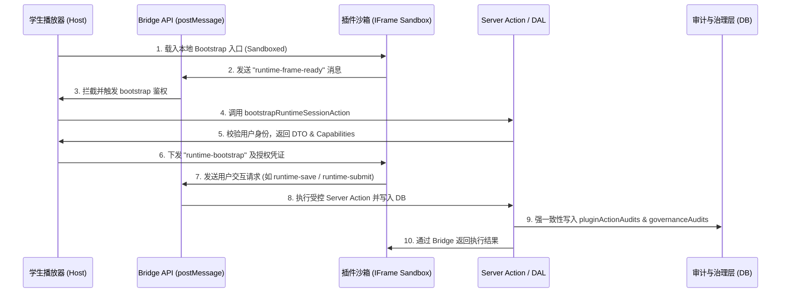

# OpenLearn Next 插件系统架构评测与演进蓝图
> [!NOTE]
> 本文档是针对 **OpenLearn Next** 当前的扩展插件机制（Theme + Plugin Spec）进行的深度架构 review 与可行性评估，并探讨了如何借鉴 **JupyterLab** 的先进理念，构建一个兼顾 **K-12 信息安全红线** 与 **高度业务灵活性** 的现代插件系统。

---

## 一、 当前插件系统架构透视 (As-Is Architecture)

当前系统正处于 `v2.4 Plugin Data Architecture & Default Plugins` 的关键迭代期，整体设计思想体现了**“安全边界第一，数据集中治理”**的原则。

### 1. 核心链路与沙箱模式
系统主要通过 `iframe` 将外部插件或课件运行环境（Runtime-Platform）与主系统隔离，通过标准化的 `postMessage` 信道（Bridge）传递高度受控的结构化消息。



### 2. 数据库设计与数据治理边界
当前项目明确为 **SQLite-first** 架构，为了规避插件在运行期随意创建物理表导致数据库失控或产生安全漏洞，系统采用了**“核心表 + 插件扩展表 + JSON 插件自有表”**的混合方案。

```
                    ┌────────────────────────────┐
                    │     core_tables (Core)     │
                    │ (lessons, steps, resources)│
                    └──────────────┬─────────────┘
                                   │
         ┌─────────────────────────┼─────────────────────────┐
         ▼ 1:N                     ▼ 1:N                     ▼ 1:N
┌──────────────────┐      ┌──────────────────┐      ┌──────────────────┐
│plugin_ext_lesson │      │plugin_ext_step   │      │plugin_ext_res    │
│ (Lesson 插件扩展)│      │  (Step 插件扩展)  │      │ (Resource 扩展)  │
└──────────────────┘      └──────────────────┘      └──────────────────┘
         │                         │                         │
         └─────────────────────────┼─────────────────────────┘
                                   │ N:1 references
                                   ▼
                       ┌────────────────────────┐
                       │   pluginRegistration   │
                       │ (插件注册/生命周期控制) │
                       └───────────┬────────────┘
                                   │ 1:N
                                   ▼
                       ┌────────────────────────┐
                       │plugin_owned_biz_data   │
                       │ (插件私有结构化KV存储)  │
                       └────────────────────────┘
```

* **安全防护亮点**：
  * **deriveDbNamespace**：基于 `pluginKey` 的规范化数据库 Namespace 推导，在 SQLite 单文件内巧妙实现了逻辑多租户隔离，防止表名冲突。
  * **Preflight 卸载影响检测**：在执行 `uninstallPlugin` 之前，通过事务及 `preflightUninstallPlugin` 检测插件在 `plugin_ext_lesson`、`plugin_ext_lesson_step`、`plugin_ext_resource` 及 `plugin_owned_business_data` 中产生的历史遗留数据量，并生成受影响实体 ID 报告，防止静默卸载导致数据死链或严重资产丢失。

---

## 二、 现实需求可行性评估 (Feasibility Check)

> [!IMPORTANT]
> **结论**：当前架构在**教育垂直场景（K-12 强隐私、高防爆、防 XSS 攻击）**中是**极其优秀且能完美落地**的。但在**高动态的业务扩展、极致的 UI 美学融合、跨应用协同**的复杂现实需求中，当前架构会面临巨大的掣肘。

### 1. 架构优势（为什么能完美解决教育需求）
1. **彻底杜绝第三方代码越权（Security First）**：禁止使用 `eval()`、禁止外部动态 JS 导入、利用 `sandbox="allow-scripts allow-forms allow-same-origin"` 限制 iframe 越狱。这完美捍卫了学校数据的安全红线。
2. **极佳的审计与防作弊追踪（Auditability）**：每一次状态保存（`runtime-save`）、作业提交（`runtime-submit`）都必须调用 `runPluginHook`。宿主在服务端对插件的生命周期（Transition Matrix 检查）和权限（`PLUGIN_ACTION_PERMISSION_REQUIREMENTS`）进行极其苛刻的双通道校验，任何越权行为都会被 `governanceAudits` 详细记录。这为防作弊、行为溯源提供了可靠的凭证。
3. **PPR (局部预渲染) 的无缝兼容**：静态宿主壳在客户端渲染，动态进度挂载到 `<Suspense>` 流中，iframe 只负责内部纯渲染，数据更新通过 Next.js 16 Server Actions 和 `updateTag` 机制强力刷缓存，完全符合 App Router 的高性能并发加载诉求。

### 2. 现实痛点与瓶颈限制（无法应对的复杂业务场景）
* **痛点1：UI 的“iframe 孤岛效应”严重打破 Stitch 视觉美学**
  * 在现代教研场景中，插件通常需要在编辑器中添加悬浮工具栏、右键菜单，或者在学生播放器内实时渲染高度定制的交互组件。
  * 采用 `iframe` 挂载，会因为 iframe 固定尺寸带来“双滚动条”、页面高度抖动。且由于 iframe 内部是完全独立的 DOM 树，外部主应用的设计系统样式（Lexend 字体、Stitch 渐变色、 tonality layering 等）无法无缝渗透进插件中，导致插件视觉呈现生硬，无法体现 premium 的设计感。
* **痛点2：逻辑扩展变成了“伪命题”——硬编码的 Actions 列表**
  * `registry.ts` 中写死了 `dispatchPluginAction` 能处理的 Actions 允许列表（如 `addStepSuggestion`, `annotateLesson` 等）。
  * **问题在于**：如果一个开发者想要开发一个“师生弹幕互动”插件，因为目前主系统的 Action 列表里根本没有“弹幕实时广播”这一项，该插件就完全无法运行。为了运行它，开发者必须先提交 PR 去修改 OpenLearn 的核心代码。这严重违反了**开闭原则（Open-Closed Principle）**，插件生态无法形成真正去中心化的开发者市场。
* **痛点3：零跨应用/跨插件通信能力（No IPC）**：
  如果“学情分析 Agent”插件需要调用“日程提醒”插件的 `createScheduleReminderDraft` 接口，因为完全没有总线或依赖注入机制，它们在运行时是两个完全孤立的盒子，无法协同产生更大的业务价值。

---

## 三、 JupyterLab 插件架构深度解析

**JupyterLab** 是现代富客户端插件系统的集大成者，被誉为前端的“微内核操作系统”。它之所以拥有无与伦比的扩展能力，核心归功于以下三项技术支柱：

### 1. Lumino (前身为 PhosphorJS) 依赖注入容器
JupyterLab 的主外壳只是一个空框架，所有的核心功能（Notebook、Terminal、File Browser、Sidebar）全是插件。它们之间的通信与发现不靠全局 hardcoded 接口，而是依靠 Lumino 的**强类型依赖注入（Dependency Injection）**。

* 每个插件通过声明一个 `Token` 表达自己提供的服务：
  ```typescript
  // 声明文档管理器服务的强类型 Token
  export const IDocumentManager = new Token<IDocumentManager>('jupyter.services.document-manager');
  ```
* 其它插件只需要在 `requires` 中声明这个 `Token`，在激活时，容器就会自动将服务的实例传入：
  ```typescript
  export const myCustomPlugin: JupyterLabPlugin<void> = {
    id: 'my-plugin',
    requires: [IDocumentManager], // 声明依赖
    activate: (app, docManager: IDocumentManager) => {
      // 激活时直接使用注入的文档管理器
      docManager.createNew('notebook');
    }
  };
  ```

### 2. 统一的 Dom 树与 Widget 架构
JupyterLab 没有使用任何 iframe 隔离。它的所有 UI 均由 Lumino 的 `Widget` 树构成。
* 任何插件都可以向宿主的 Shell 动态注册菜单（Menu Bar）、命令（Command Palette）、状态栏（Status Bar）或侧边栏（Sidebar Tab）。
* 这使得所有插件的视觉、焦点控制、交互体验和设计系统都 100% 保持了高度的无缝一致性。

### 3. Webpack Module Federation / 动态构建
JupyterLab 支持在运行时动态拉取、解析并加载已经打包好的外部 JS Bundle（ESModule 格式），并将其注册到依赖注入容器中，实现真正的插件即装即用。

---

## 四、 OpenLearn Next 插件机制演进蓝图 (To-Be Roadmap)

为了让 OpenLearn Next 成为名副其实的**“未来教育 AI 原生开源操作系统”**，我们不能照搬 JupyterLab 牺牲安全性的纯原生 JS 挂载方案，也不能止步于当前过于局限的纯 iframe 方案。

我们应该设计一套 **"Hybrid Secure Plugin Architecture" (混合安全插件架构)**。

```
┌────────────────────────────────────────────────────────┐
│               OpenLearn Next 主程序 (Host)              │
│  Stitch Design System | Next.js 16 + React 19 + Drizzle│
└───────────┬────────────────────────────────┬───────────┘
            │                                │
            ▼ UI 挂载层                      ▼ 逻辑计算层
┌────────────────────────┐      ┌────────────────────────┐
│  Shadow DOM Component  │      │   QuickJS WASM 沙箱    │
│    (Web Components)    │      │    (WASM Virtual VM)   │
├────────────────────────┤      ├────────────────────────┤
│ • 无 iframe 孤岛效应   │      │ • 100% 阻断宿主 DOM    │
│ • DOM/CSS 独立隔离     │      │ • 禁止直接访问 Window   │
│ • 支持 Stitch 设计系统  │      │ • 仅允许基于 RPC 通信  │
│   全局 CSS 变量继承    │      │ • 毫秒级轻量加载       │
└────────────────────────┘      └────────────────────────┘
```

### 1. 架构升级提案 (Evolutionary Blueprint)

#### A. 破解 UI 孤岛：从 iframe 走向 Web Components (Shadow DOM)
* **实现方案**：放弃为每个 UI 挂载点建立 iframe 的做法，转而利用 React 19 强大的原生 Web Components 支持，将插件 UI 载入到宿主的 **Shadow DOM** 中。
* **收益**：
  * 插件 DOM 与外部天然隔离，插件自身的样式不会污染主应用。
  * 主应用可以通过 `:host` 和继承的 **CSS 变量（Tailwind v4 tokens）**，动态向 Shadow DOM 内部同步 Stitch 设计系统的 Lexend 字体、圆角大小和灰度色阶，达到**视觉上的浑然一体**。
  * 彻底消除了 iframe 双滚动条、非响应式大小高度抖动的噩梦。

#### B. 破解 Action 瓶颈：引入 QuickJS (WebAssembly 编译) 作为受限计算沙箱
为了让开发者能够编写自定义的交互与计算逻辑，同时不越过信息安全红线，我们可以在服务端与客户端（Vercel Edge & 浏览器）部署由 **WASM 编译的 QuickJS 引擎**。
* **机制**：
  * 第三方插件的 JS 业务逻辑在这个 WASM 虚拟空间（Virtual Machine）里运行。
  * 在这个虚拟机里，**没有 `window`、没有 `document`、没有 `XMLHttpRequest/Fetch`**。它是一个纯粹的“逻辑孤岛”。
  * 虚拟机只提供一个受限的 `hostBridge` 代理。插件要进行存储或网络调用，必须向主系统发送声明式消息，由主系统进行合规拦截、权限校验后代为执行（即 **Sandbox RPC** 模式）。

#### C. 引入声明式的 Lumino-style Event Bus (事件总线)
在主程序中设计一个极简的事件总线，插件可以通过 JSON 配置文件（Manifest）声明式地订阅系统事件：
```json
{
  "id": "schedule-reminder-plugin",
  "anchors": ["schedule.assistant"],
  "eventSubscriptions": [
    {
      "event": "classroom.session.stateChange",
      "filter": "state == 'locked'",
      "action": "triggerReminder"
    }
  ]
}
```
当特定事件被系统广播时，宿主调起该插件的 QuickJS 沙箱实例，传入安全的上下文（`userId`, `schoolId`），执行其 `triggerReminder` 脚本，沙箱计算后输出一个标准 Action 请求（如 `createScheduleReminderDraft`），完美保持了事件驱动的高灵活性与绝对可控的安全性。

### 2. 演进阶段规划 (Phased Roadmap)

| 阶段 | 核心任务 | 技术选型 | 交付物/里程碑 |
| :--- | :--- | :--- | :--- |
| **Phase 1 (当前-已完成骨架)** | 固化身份、命名空间、数据扩展边界，落地双审计表。 | Next.js 16 + Drizzle + SQLite | 奠定 `v2.4` 数据边界与 preflight 预检闸门，完成内置插件样板。 |
| **Phase 2 (近期规划)** | 移除 iframe 限制，升级为 Shadow DOM 局部挂载，通过 CSS variables 同步 Stitch 视觉。 | React 19.2 + Shadow DOM | 彻底解决高度抖动与 UI 孤岛问题，使插件符合 premium 美学。 |
| **Phase 3 (AI 原生演进)** | 引入 **QuickJS WASM** 沙箱，实现插件自定义受控计算逻辑；开放 Event Bus 订阅模型。 | WebAssembly + QuickJS + EventBus | 建立插件沙箱虚拟机，支持第三方开发者动态编写逻辑，无需修改核心库。 |
| **Phase 4 (生态闭环)** | 引入 Lumino 风格的轻量级 DI 容器，支持多插件间的 Token 服务依赖注入与联合协作。 | TypeScript DI Container | 开启多插件联动，支持 AI 多 Agent 插件与工具链的无缝绑定。 |

---
> [!TIP]
> **Antigravity 专家建议**：目前项目的 `v2.4` 在底层数据库、事务一致性和审计治理（`governanceAudits`）上做得极其出色，结构非常稳固。下一步的核心演进重点应放在 **“UI 的 Web Component 化（Shadow DOM）”** 上。这将在不牺牲安全性的前提下，率先从视觉和用户体验上把 OpenLearn Next 插件机制推向 state-of-the-art 的高级感。
